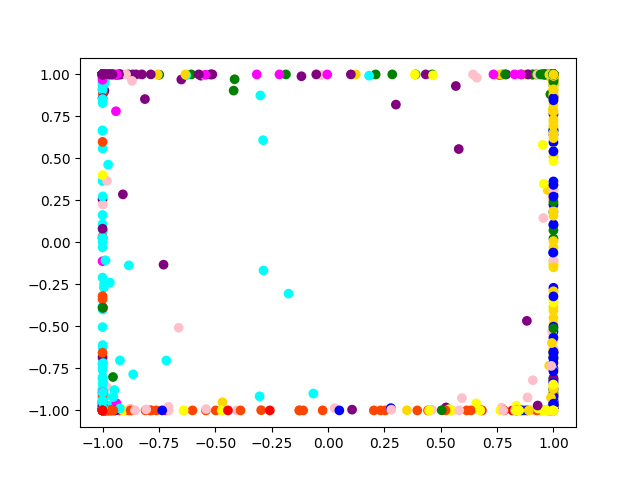
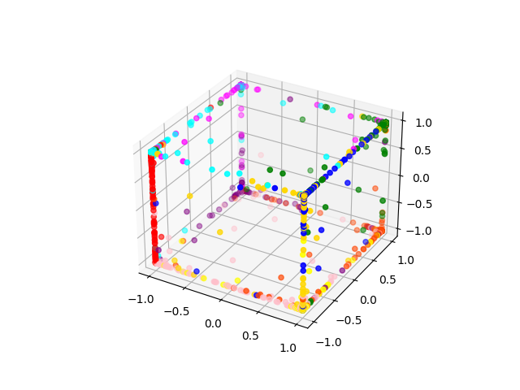

# Multilayer Perceptron

Basic implementation of a multilayer perceptron using only NumPy. The current implementation uses tanh to calculate z (the hidden layer) and softmax to calculate y (the output layer). Weights are adjusted after completing a whole batch of training data (full-batch processing)

* Validation accuracy: 0.914
* Test accuracy: 0.912

The optdigit_train, validate, and test txt files are from Kaggle. The final column of each row represents the label/class. The images below demonstrate the success in confidently separating classes based on the first 3 columns (each color is a class). With so many columns/dimensions to the data, it is otherwise difficult to visualize the separation

Note that altering the number of layers or the nonlinear functions at each layer requires rederivation of the backpropagation equations (implementing gradient descent).

Additional Resources:

* [Scikit-Learn guide to Neural Networks](https://scikit-learn.org/stable/modules/neural_networks_supervised.html)
* [Backpropagation Concepts](https://hmkcode.com/ai/backpropagation-step-by-step/)
* [Partial Derivative Guide](https://medium.com/binaryandmore/beginners-guide-to-deriving-and-implementing-backpropagation-e3c1a5a1e536)

